# Covid-19_Mid_Course_Project
This project would provide information about covid-19 in worldwide and spanish scope during 2020 and 2021.

It is composed of an api which fulfills the function of providing information to the dashboard that will allow us to kindly see it.

Let's begin!

## Installation

First of all, you will need python 3.9 to run the full repository. Now let's see more specific requirements needed, which you can install using the command:
``` shell
pip install {library}
```

- API libraries, located at Mid_Course_Project/api/requirements.txt
- DASHBOARD libraries, located at Mid_Course_Project/dashboard/requirements.txt

## Using the API

For running the API just type this command, while you are placed inside api folder:

``` shell
uvicorn main:app
```

You must copy the IP given in the prompt and paste it into your browser.

If everything worked out properly, you should get something like this.
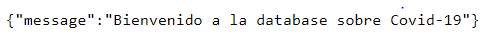

Now you can add the endpoint "/docs" to browse in the database.
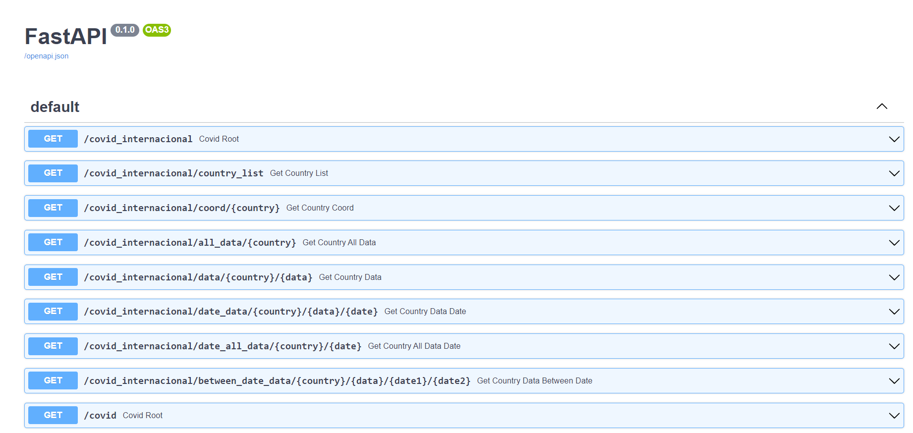

## Endpoints' breakthrough
You can inquire to two different database, covid_internacional and covid_ccaa. The variables which you can choose are set between {}.

- **Worldwide**

     {country}: Type a country in the country list.

     {data}: Type data wanted, Cases, Deaths o Recovered.

     {date}: Type a date with format, YYYY-MM-DD.

Now adding this endpoints to your browser you will get:

     - +"/covid_internacional" Returns a greeting message.

     - +"/covid_internacional/country_list" Returns a list of the countries in the database.

     - +"/covid_internacional/coord/{country}" Returns the coordinates of a country.

     - +"/covid_internacional/all_data/{country}" Returns all data of a country.

     - +"/covid_internacional/data/{country}/{data}" Returns a specific data of a country.

     - +"/covid_internacional/date_data/{country}/{data}/{date}" Returns a specific data on a specific date for a country.

     - +"/covid_internacional/date_all_data/{country}/{date}" Returns all data on a specific date for a country.

     - +"/covid_internacional/between_date_data/{country}/{data}/{date1}/{date2}" Returns a specific data between two dates for a country.

     - +"/covid_internacional/between_date_all_data/{country}/{date1}/{date2}" Returns all data between two dates for a country.


- **Spain**

     {ccaa}: Type a ccaa in the ccaa list.

     {vaccine}: Type vaccine wanted, Pfizer, Moderna, AstraZeneca, Janssen.

     {positions}: Type a certain number of ccaas.

Now adding this endpoints to your browser you will get:

     - +"/covid_ccaa" Returns a greeting message.

     - +"/covid_ccaa/list" Returns a list of ccaas.

     - +"/covid_ccaa/most_complete_vaccinated" Returns a list of ccaa sorted by complete vaccinated population.

     - +"/covid_ccaa/basic_data/{ccaa}" Returns population, cases, deaths, total and percentage of population vaccinated.

     - +"/covid_ccaa/full_data/{ccaa}" Returns all data of a ccaa.

     - +"/covid_ccaa/{vaccine}/{positions}" Returns a list of certain number(positions) of ccaa sorted by number of vaccine doses received.

## Using the DASHBOARD

For running the DASHBOARD just type this command, while you are placed inside dashboard folder:

``` shell
streamlit run main.py
```

You must copy the IP given in the prompt and paste it into your browser.

If everything worked out properly, you should get something like this.

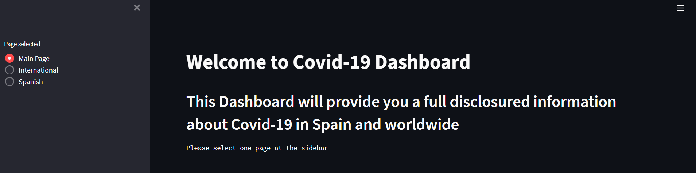

Now you have to choose one page at the sidebar on your left.

#### International

If you choose international, the first thing you will see it is a countries selector where you have to select the countries you want to see information about.

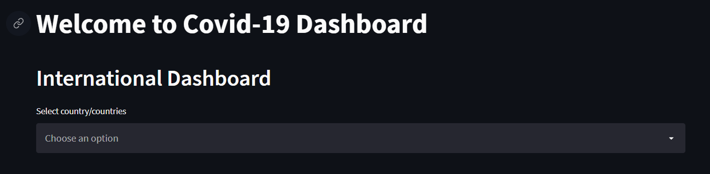

Once countries are selected, the dashboard shows a dataframe with all information about the countries, also you can sort the dataframe clicking at the column's names

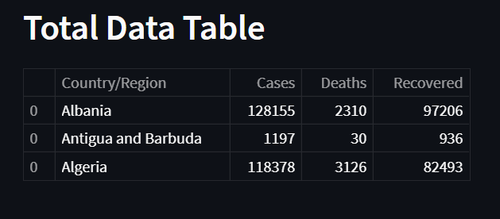

Next there is a map with markers at the countries wanted, and if you put your pointer at one on them, a popup will show you a new variable, % death per case in each country.

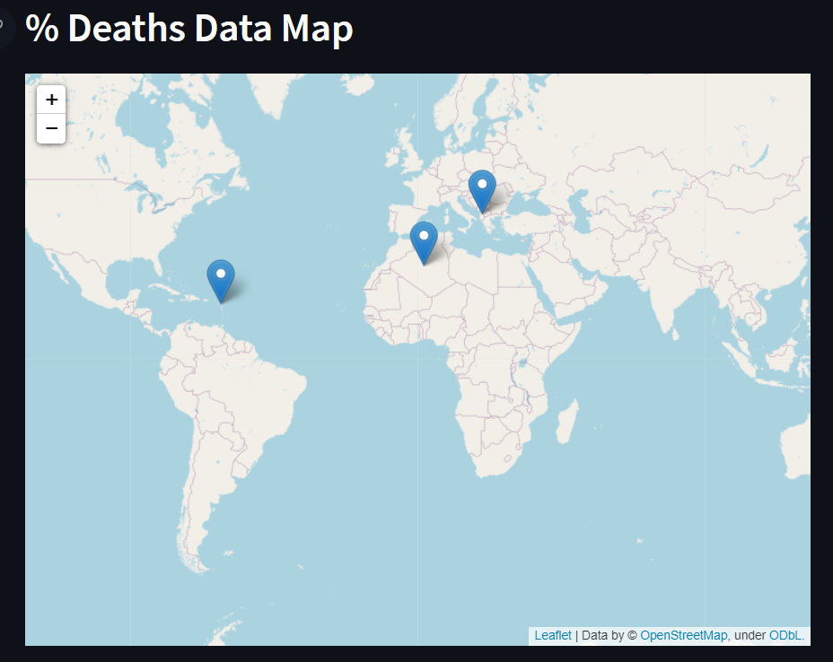

Lastly, you get a graph where you can see the evolution of a certain data comparing countries, between two dates chosen by you.

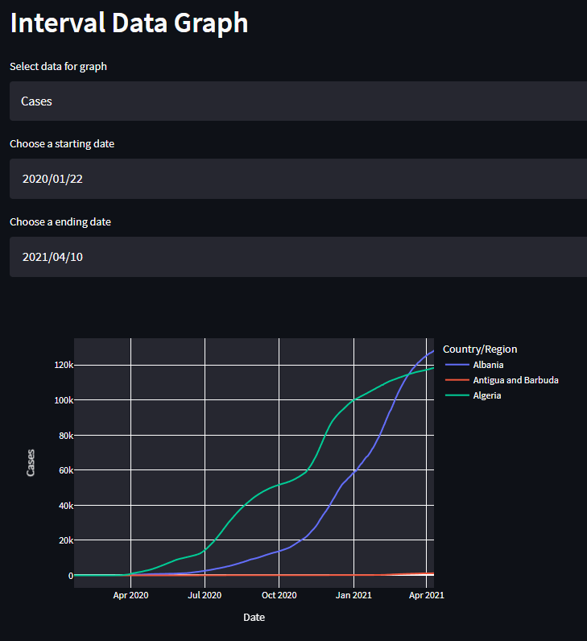

#### Spain

If you choose Spain, first of all select ccaas in the selector.

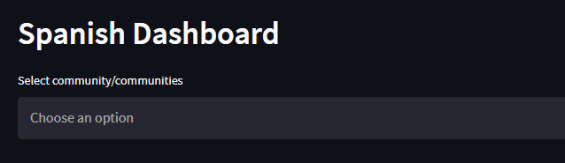

Now you will a dataframe similar to the one on international page, you can see some information about population, cases, deaths, vaccinated, etc.

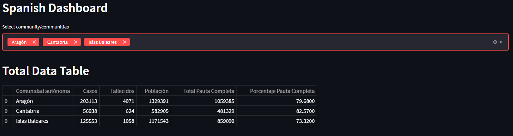

Next a very interesting dashboard, a radar plot that displays how many vaccine's doses were given, how many were dispensed, full vaccine population and total population of each ccaa.

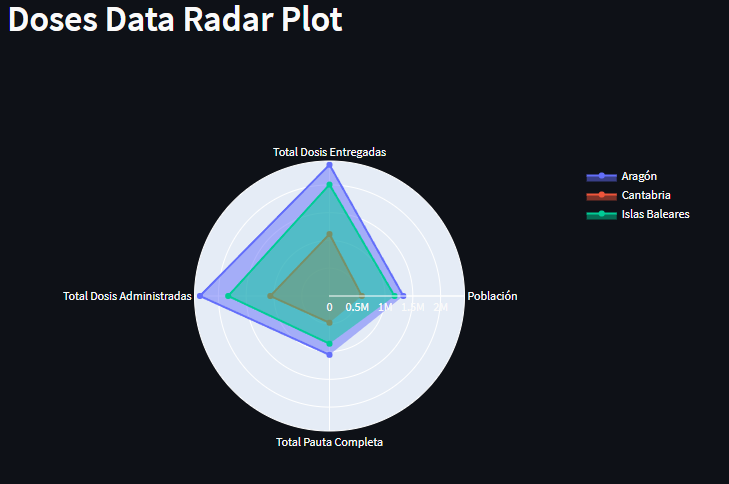

Lastly, a comparative pie chart where you choose two ccaas and it shows the percentage of each vaccine's brand.

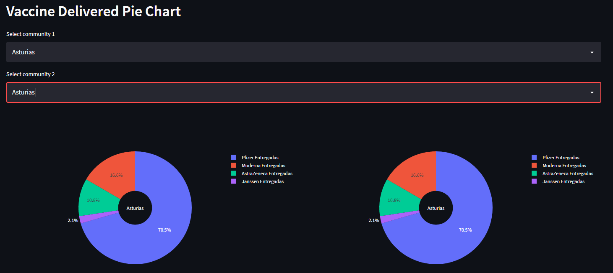

